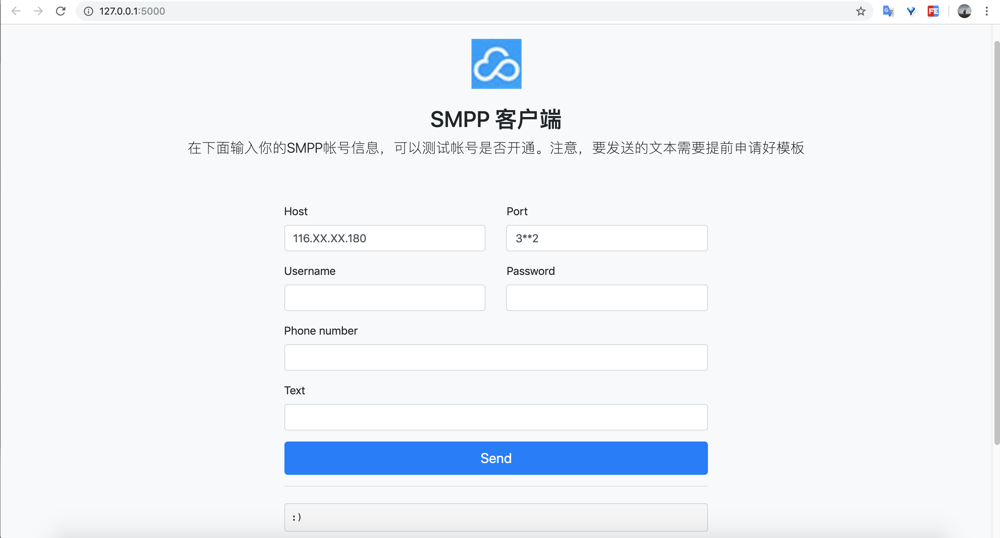

## 说明

SMPP Web 版客户端。

## 需要安装

    pip3 install flask
    pip3 install waitress
    pip3 install werkzeug
    pip3 install smpplib
    
## 部署方法
    
    # 在本文件所在目录执行：
    waitress-serve --port=3000 main:app
    
    # 然后访问 http://127.0.0.1:3000 即可

